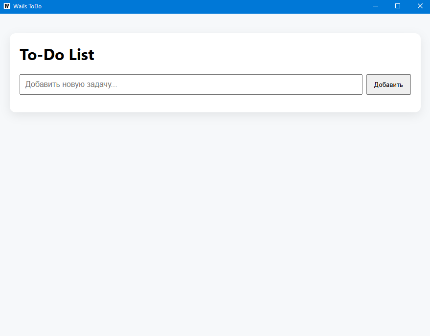
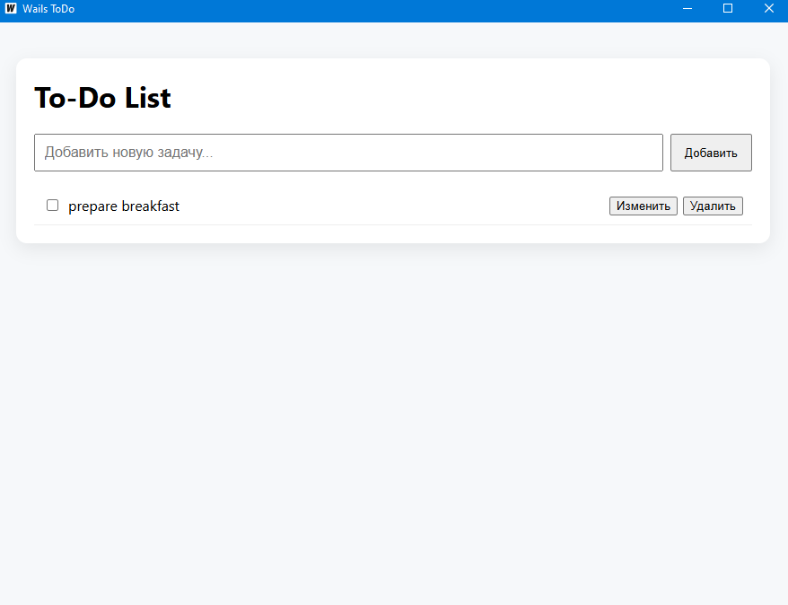
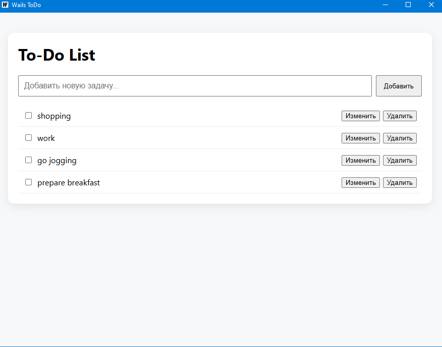
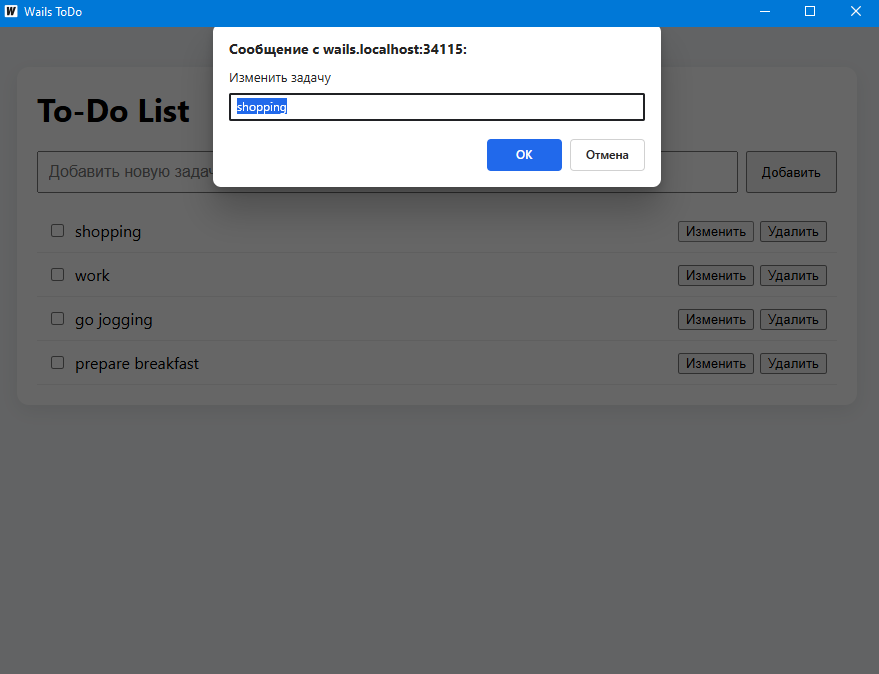
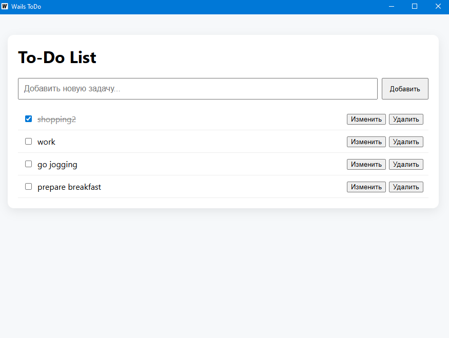
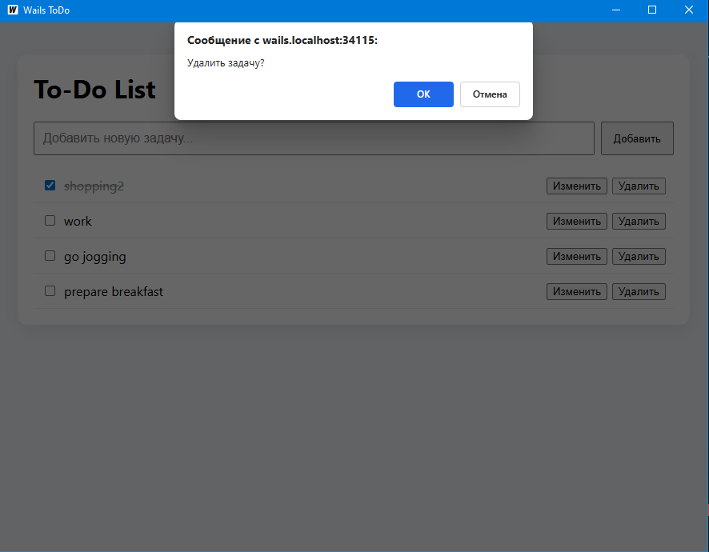

# wails-todo-app

This is a simple cross-platform Todo application built with Wails (Go for backend, modern web frontend). It allows you to add, view, and manage your tasks with a clean and minimal interface. The backend is written in Go, while the frontend uses standard web technologies. The app demonstrates how to connect Go logic with a JavaScript/HTML/CSS frontend using Wails.

## Assets

### Images

### Video

## Backend API (Go)

Below are the descriptions of all exported functions in `backend/todo.go`:

### `NewTodoService()`
Creates a new instance of `TodoService` and loads tasks from storage.

### `GetTasks()`
Returns the list of all tasks.

### `AddTask(text string)`
Adds a new task with the provided text. Returns the created task or an error if the text is empty or saving fails.

### `ToggleDone(id string)`
Toggles the completion status (`Done`) of the task with the given ID. Returns the updated task or an error if not found or saving fails.

### `UpdateTask(id, text string)`
Updates the text of the task with the given ID. Returns the updated task or an error if not found or saving fails.

### `DeleteTask(id string)`
Deletes the task with the given ID. Returns an error if not found or saving fails.

---